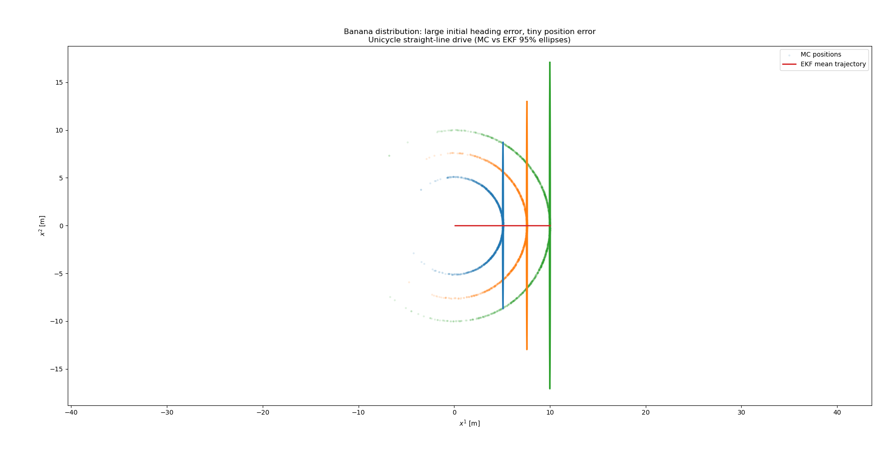
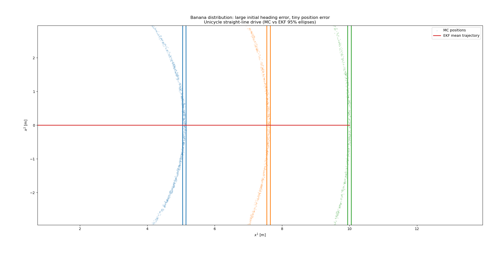
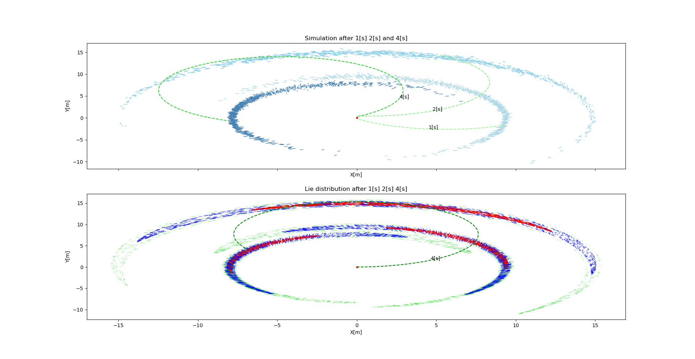
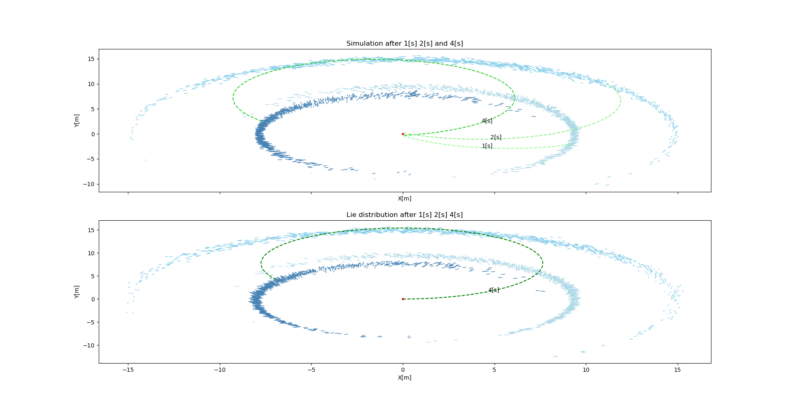

#+OPTIONS: toc:nil num:nil
#+LATEX_CLASS: article
#+LATEX_CLASS_OPTIONS: [12pt,a4paper]

# --- Page geometry & typography
#+LATEX_HEADER: \usepackage[margin=1in]{geometry}
#+LATEX_HEADER: \usepackage{mathpazo}           % Palatino text & math
#+LATEX_HEADER: \usepackage{amsmath,amssymb,amsthm}
#+LATEX_HEADER: \usepackage{microtype}
#+LATEX_HEADER: \usepackage{setspace}
#+LATEX_HEADER: \setstretch{1.15}
#+LATEX_HEADER: \usepackage{parskip}            % space between paragraphs
#+LATEX_HEADER: \usepackage{fancyhdr}
#+LATEX_HEADER: \usepackage{graphicx}           % for the logo
#+LATEX_HEADER: \pagestyle{fancy}
#+LATEX_HEADER: \fancyhf{}
#+LATEX_HEADER: \usepackage{xcolor}
#+LATEX_HEADER: \newcommand{\mathcolorbox}[2]{\colorbox{#1}{$\displaystyle #2$}}
#+LATEX_HEADER: \rhead{Barak Diker}
#+LATEX_HEADER: \lhead{Ph.D. Research Proposal}
#+LATEX_HEADER: \cfoot{\thepage}
#+bibliography: ./refs.bib
#+cite_export: biblatex

# --- Common math macros
#+LATEX_HEADER: \newcommand{\R}{\mathbb{R}}
#+LATEX_HEADER: \newcommand{\N}{\mathbb{N}}
#+LATEX_HEADER: \newcommand{\Z}{\mathbb{Z}}
#+LATEX_HEADER: \newcommand{\SO}{\mathrm{SO}}
#+LATEX_HEADER: \newcommand{\SE}{\mathrm{SE}}
#+LATEX_HEADER: \newcommand{\so}{\mathfrak{so}}
#+LATEX_HEADER: \newcommand{\se}{\mathfrak{se}}
#+LATEX_HEADER: \newcommand{\Exp}{\mathrm{Exp}}
#+LATEX_HEADER: \newcommand{\Log}{\mathrm{Log}}
#+LATEX_HEADER: \newcommand{\T}{^{\mathsf{T}}}
#+LATEX_HEADER: \newcommand{\inv}{^{-1}}
#+LATEX_HEADER: \newcommand{\norm}[1]{\left\lVert #1 \right\rVert}
#+LATEX_HEADER: \newcommand{\abs}[1]{\left\lvert #1 \right\rvert}
#+LATEX_HEADER: \newcommand{\tr}{\mathrm{tr}}
#+LATEX_HEADER: \newcommand{\diag}{\mathrm{diag}}
#+LATEX_HEADER: \newcommand{\E}{\mathbb{E}}
#+LATEX_HEADER: \newcommand{\Cov}{\mathrm{Cov}}
#+LATEX_HEADER: \newcommand{\Var}{\mathrm{Var}}
#+LATEX_HEADER: \newcommand{\Prob}{\mathbb{P}}
#+LATEX_HEADER: \newcommand{\dif}{\mathrm{d}}

# --- Variables: edit these paths/texts as needed
#+LATEX_HEADER: \newcommand{\LogoPath}{./figures/Logo.png} % e.g., ./Logo.png  (put your file here)
#+LATEX_HEADER: \newcommand{\StudentName}{Barak Diker}
#+LATEX_HEADER: \newcommand{\SupervisorName}{Itzik Klein}
#+LATEX_HEADER: \newcommand{\LabName}{Autonomous Navigation and Sensor Fusion Lab}

# ---- definition and theorem macros
#+LATEX_HEADER: \usepackage[dvipsnames]{xcolor}
#+LATEX_HEADER: \usepackage[most]{tcolorbox}
#+LATEX_HEADER: \newtcolorbox{mycorollary}{colback=SkyBlue!10!white,colframe=SkyBlue!50!black}
#+LATEX_HEADER: \newtcolorbox{mytheorem}{colback=SkyBlue!10!white,colframe=SkyBlue!50!black}
#+LATEX_HEADER: \newtcolorbox{mydefinition}{colback=SkyBlue!10!white,colframe=SkyBlue!50!black}

# --- Cover page (first page) ---
#+BEGIN_EXPORT latex
\begin{titlepage}
  \thispagestyle{empty}
  \begin{center}
    \vspace*{0.5cm}
    \includegraphics[width=0.62\textwidth]{\LogoPath}\\[1.8cm]
    {\Large \textsc{\LabName}}\\[1.2cm]
    {\huge \bfseries Ph.D. Research Proposal}\\[1.4cm]
    {\Large \textbf{\StudentName}}\\[0.6cm]
    {\large Supervisor: \textbf{\SupervisorName}}\\[2.2cm]
    \vfill
    {\large \today}
  \end{center}
\end{titlepage}
\pagenumbering{arabic}
#+END_EXPORT

* Abstract
Autonomous Underwater Vehicles (AUVs) rely heavily on accurate navigation for deep-water exploration and research. Conventional Kalman Filters, while widely used in inertial navigation, face challenges when applied to systems evolving on nonlinear manifolds, often leading to inconsistency and degraded performance in long-duration missions. This knowledge gap motivates the development of Invariant Kalman Filters (IKFs), which exploit the underlying Lie group structure of motion dynamics to achieve improved consistency, stability, and robustness.

In this study, we investigate the application of the Invariant Kalman Filter for underwater navigation using data collected off the coast of Haifa, Israel, with the Snapir AUV. Snapir is a modified ECA Group A18D mid-size AUV designed for deep-water missions up to 3000 meters and 21 hours of endurance. It is equipped with a high-performance iXblue Phins Subsea fiber-optic gyroscope-based inertial navigation system and a Teledyne RDI Work Horse Navigator Doppler Velocity Log (DVL), enabling precise measurements of orientation, acceleration, and velocity. The IKF framework is tailored to fuse these measurements while respecting the systems nonlinear structure

Preliminary results are expected to demonstrate improved navigation accuracy and reduced drift compared to conventional Extended Kalman Filter approaches, particularly during long-duration and deep-water missions where GPS signals are unavailable. The research holds significance for advancing underwater navigation technology, enhancing the reliability of AUV-based oceanographic surveys, and enabling more effective scientific and industrial exploration in challenging subsea environments.

* Introduction to the Navigation Problem 
The inertial navigation problem is concerned with estimating the position, velocity, and orientation of a platform using onboard sensors. In practice, this is achieved by integrating data from inertial measurement units (IMUs), and refining these estimates with external measurements such as GNSS, GPS, Doppler Velocity Log (DVL), or other aiding sensors. Accurate state estimation in this context is crucial for applications ranging from autonomous vehicles to aerospace systems, where reliability and robustness are paramount.

A classical approach to this estimation problem is the Extended Kalman Filter (EKF)[cite:@groves9101092]. In the EKF framework, the system dynamics are propagated forward in time and linearized around the current state estimate, while sensor models are incorporated to correct the estimate when new measurements become available. Despite its widespread success, this method has well-known limitations: the linearization process introduces a strong dependence of the system matrix on the current estimate, which can lead to inconsistency and reduced robustness, especially under poor initial conditions.

Recent advances[cite:@barrau2015invariantextendedkalmanfilter] leverage *Lie group theory* to reformulate the estimation problem, leading to the development of the Invariant Kalman Filter (IKF)[cite:@barrau:tel-01344622]. Unlike the classical EKF, the IKF describes error propagation in a way that is consistent with the underlying geometry of the state space. This formulation significantly reduces the dependence of the system matrix on the current estimate, yielding improved stability and accuracy. Moreover, while the EKF assumes error distributions that are well approximated by ellipsoids, the IKF naturally accommodates banana-shaped distributions, which more closely reflect the true uncertainty structure in inertial navigation.

This distinction is particularly important in scenarios where high-quality IMUs are available but the initial conditions are poor. In such cases, the invariant framework can maintain filter consistency without relying on the traditional two-stage process of coarse and fine alignment. Instead, a single IKF can provide a robust solution that adapts naturally to the navigation problem's geometry and measurement structure. To my knowledge, most contributions in this area have remained primarily theoretical. With access to the Snapir AUV and Ariel AUV, I am in a unique position to carry out experimental validation, providing practical demonstrations of the theory in real-world underwater navigation scenarios.
* Research Goals
While the benefits of respecting the geometric structure of navigation dynamics have been well recognized in theoretical works on Lie groups and invariant filtering, practical adoption has been limited. The majority of operational navigation systems continue to rely on classical EKF-based architectures or their unscented and iterated variants, largely due to their familiarity, availability of mature software implementations, and established performance in standard conditions.

Recent research in state estimation has been dominated by two trends:

- *Data-driven enhancements* [cite:@YAMPOLSKY2025104525], where machine learning models (e.g., deep neural networks, Gaussian processes) are used to augment prediction or measurement models.
- *Adaptive filtering approaches* [cite:@COHEN2025110221][cite:@NA11028550], including auto-regressive and statistical learning techniques for bias estimation and noise covariance tuning

Although these approaches have improved performance in certain cases, they generally maintain the traditional state-space formulation in \(\mathbb{R}^n\), and thus inherit its limitations when applied to inherently geometric systems like inertial navigation. By contrast, the Invariant Kalman Filter provides a principled way to integrate system symmetries into the estimation process, yielding error dynamics that are independent of the estimated trajectory and more robust to large initialization errors.

To date, there is a shortage of empirical studies that:
- Quantitatively compare IKF performance against both conventional and augmented Kalman filters in realistic navigation scenarios.
- Investigate the use of data-driven and adaptive estimation strategies-such as neural augmentation, Gaussian processes, or online noise adaptation-formulated directly on Lie groups, thereby preserving the underlying geometric structure of navigation dynamics
- Provide a systematic observability analysis of the Invariant Kalman Filter, clarifying its advantages and limitations relative to classical formulations.

*This research will address these gaps by systematically comparing invariant filtering to established alternatives and by developing methodologies for integrating modern learning-based and adaptive techniques within the Lie group framework.*

* COMMENT Methodology
The proposed research will be carried out in two main stages: algorithm development and performance evaluation.
** COMMENT Algorithm Development
An Adaptive Invariant Kalman Filter (AIKF) will be implemented for inertial navigation on the Lie group SE2(3) SE2(3), incorporating online adaptation of process and measurement noise covariances. The adaptive mechanism will be designed to respond to variations in the measurement quality and dynamic conditions, allowing the filter to maintain robustness during rapid maneuvers, sensor noise fluctuations, and aiding signal outages.
The AIKF will be compared against two baseline estimators:
- A classical Extended Kalman Filter (EKF) operating in the Euclidean state-space representation.
- An Adaptive Extended Kalman Filter (AEKF) that adapts noise covariances but does not exploit the underlying geometric structure.

* Dataset
Experimental validation will use real-world navigation data collected by our team from the autonomous submarine Snapir. The dataset is publicly available at: https://github.com/ansfl/A-KIT. It contains synchronized measurements from an onboard Inertial Measurement Unit (IMU), aiding sensors DVL, and ground-truth reference trajectories obtained from post-processing. This dataset provides a realistic and challenging evaluation environment due to its underwater setting, which is characterized by GNSS-denied navigation, variable sensor quality, and complex vehicle dynamics.

* Evaluation Procedure
The experimental procedure will involve:
- Preprocessing and time synchronization of sensor measurements.
- Implementing the two filters (EKF, , IKF) under a common navigation framework to ensure fair comparison.
- Running each filter over multiple mission segments, including high-dynamic maneuvers, long aiding-sensor outages, and bias-drift conditions.
- Quantitatively evaluating performance using metrics such as:
  1. Root Mean Square Error (RMSE) in position, velocity, and orientation.
  2. Filter consistency, measured via Normalized Estimation Error Squared (NEES).

* Theoretical Background 
** Introduction to Invariant Kalman Filtering 
*** Introductory Example
Consider the deterministic linear model system[cite:@barrau2015invariantextendedkalmanfilter] \( \frac{d}{dt}x_{t} = A_{t}x_{t} \). Consider 2 trajectories of this system. A reference trajectory \( (x_{t})_{t\geq 0} \) and an estimated trajectory \( (\hat{x}_{t})_{t\geq 0} \) . The "difference" between both trajectories is define by \( \Delta x_{t} := x_{t} -\hat{x}_{t} \) and this quantity satisfy the ODE \(\frac{d}{dt} \Delta x_{t} = A_{t}\Delta x_{t} \). This is a key property for the design of the linear convergent observers, as during the propagation step, the evolution of the error the true state and the estimated state does *not* depend on the true state's trajectory

In contrast, let us now consider non-linear model of 2 dimensional non-holonomic car. the state is define by 3 parameters: \( \theta_{t} \) and positioning \( X_{t}:= (x_{t}^{1},x_{t}^{2}) \), the velocity is given by odometer \( u_{t}\in \mathbb{R} \) and the angular velocity  \( \omega_{t}\in \mathbb{R} \) is given by gyroscope. The equations reads

\begin{align}
\frac{d}{dt}\theta_{t} &= \omega_{t} \\
\frac{d}{dt}x^{1}_{t} &= cos(\theta_{t})u_{t} \\
\frac{d}{dt}x^{2}_{t} &= sin(\theta_{t})u_{t}
\end{align}

now let us consider a reference or ground truth trajectory \( \theta_{t},x_{t}^{1},x_{t}^{2} \in \mathbb{R} \) and estimated trajectory with different initial conditions and the same input. the exact propagation of the error  \( (\Delta \theta , \Delta x^{1},\Delta x^{2}) = (\theta-\hat{\theta},x^{1}-\hat{x^{1}},x^{2}-\hat{x}^{2}  ) \) is

\begin{align}
\frac{d}{dt}\Delta \theta_{t} &= 0 \\
\frac{d}{dt}\Delta x^{1}_{t} &= (cos(\theta_{t}) - cos( \theta_{t} - \Delta\theta_{t}) ) u_{t}    \\
\frac{d}{dt}\Delta x^{2}_{t} &= (sin(\theta_{t}) - sin(\theta_{t} - \Delta \theta_{t}  )  ) u_{t}
\end{align}

We can see that the time derivative of \( (\Delta \theta , \Delta x^{1},\Delta x^{2}) \) is not only dependent on \( (\Delta \theta , \Delta x^{1},\Delta x^{2}) \) but also on the reference states itself \( (\theta ,x^{1}, x^{2}) \) . moreover, the equation is non linear and the estimation in the end will be described by ellipses and not "banana" shaped distribution[cite:@6577969] which fits more the navigation problem 

For non-linear error definition lets encode our state in a different manner.
\begin{equation}
\mathcal{X}_{t} =\begin{pmatrix}
R_{2\times 2} & p_{2\times 1} \\
0_{1\times 2} & 1 \\
\end{pmatrix} \in SE(2) \subset \mathbb{R}^{3 \times 3}
\end{equation}
where \( p \in \mathbb{R}^{2}\) is the position vector and \(R \in SO(2)\) is the orientation of the body

now I'll define the non-linear in a special way
\begin{equation}
\eta_{t} = \mathcal{X}^{-1}\hat{\mathcal{X}} =
\begin{pmatrix}
R^T & -R^Tp \\
0 & 1 \\
\end{pmatrix}
\begin{pmatrix}
\hat{R} & p \\
0 & 1 \\
\end{pmatrix}
=
\begin{pmatrix}
\mathcolorbox{green}{R^{T}\hat{R}} & \mathcolorbox{yellow}{R^{T}\hat{p}-R^{T}p} \\
0 & 1 \\
\end{pmatrix}
\end{equation}

and new non linear error \( \xi_{\theta}\in \mathbb{R} \) will be defined as
\begin{equation}
\eta_{\theta} =\mathcolorbox{green}{R^{T}\hat{R}} \approx I_{2} +\begin{pmatrix}
0 & -\xi_{\theta} \\
\xi_{\theta} & 0 \\
\end{pmatrix}
\end{equation}

and our new non-linear positon error \( \xi_{p}\in \mathbb{R}^{2} \) will be defined
\begin{equation}
\eta_{p} = J_{l}(\xi_{\theta}) \xi_{p} = \mathcolorbox{yellow}{R^{T}\hat{p} - R^{T}p}
\end{equation}
where \( J_{p}(\zeta) \in \mathbb{R}\mapsto \mathbb{R}^{2\times 2} \) is the left jacobian and when \( \zeta\approx 0 \) then \( J_{p}(\zeta) \approx I_{2\times 2}  \)

now that we have defined our new error lets derive the system matrix of our newly defined states

\begin{equation}
\frac{d}{dt}\eta_{\theta} = \frac{d}{dt}(I_{2\times 2} +
\begin{pmatrix}
0 & -\xi_{\theta} \\
\xi_{\theta} & 0 \\
\end{pmatrix}
) =
\begin{pmatrix}
0 & -\omega \\
\omega & 0 \\
\end{pmatrix}
\end{equation}
which implies that

\begin{equation}
\dot{\xi_{\theta}} = \omega
\end{equation}

and for our new non-linear position error
\begin{align}
\frac{d}{dt}\eta_{p} = 
\frac{d}{dt}(J(\xi_{\theta}) \xi_{p}) &= \frac{d}{dt}(R^{T}\hat{p}- R^{T}p) = -\omega_{\times} R^{T} \hat{p} + R^{T}\dot{\hat{p}} - (\dot{R^{T}}p + R^{T}\dot{p}) \\
&=
-\omega_{\times}R^{T}(\hat{p}-p) +R^{T}u
\begin{pmatrix}
cos(\hat{\theta})  \\
sin(\hat{\theta})  \\
\end{pmatrix}
-R^{T}
\begin{pmatrix}
cos(\theta)  \\
sin(\theta)  \\
\end{pmatrix} \\
&=
-\omega_{\times}\xi_{p} + uR^{T}\hat{R}
\begin{pmatrix}
1 \\
0 \\
\end{pmatrix}
- uR^{T}R 
\begin{pmatrix}
1 \\
0 \\
\end{pmatrix}
\\
&=
-\omega_{\times}\xi_{p} + u(I + \xi_{\theta}_{\times})
\begin{pmatrix}
1 \\
0 \\
\end{pmatrix}
-u
\begin{pmatrix}
1 \\
0 \\
\end{pmatrix}
\\
&=
-\omega_{\times}\xi_{p} +  u\xi_{\theta}_{\times}
\begin{pmatrix}
1 \\
0 \\
\end{pmatrix}
\end{align}

lets write our error equation in matrix form

\begin{equation}
\frac{d}{dt}
\begin{pmatrix}
\xi_{\theta} \\
\xi_{p_{1}}  \\
\xi_{p_{2}}  \\
\end{pmatrix}
 =
\begin{pmatrix}
0 & 0 & 0 \\
0 & 0 & \omega  \\
u & -\omega & 0 \\
\end{pmatrix}
\begin{pmatrix}
\xi_{\theta} \\
\xi_{p_{1}}  \\
\xi_{p_{2}}  \\
\end{pmatrix}
\end{equation}

This result is spectular in a sense that the new system matrix is independent of the current states the bad thing is that we only acquire the rotated position error so we know the absolute position error and not the error projected in each axis, the angle error remains the same from the ESKF 

*** Simulation of the simple example
Consider the model as before with the following scenrio, I have excellence inital conditions on the postion and poor inital condition on the heading, more precisely I have \( \theta_{t=0}=0 \) ,\(x^{1}_{t=0}=0\) and \(x^{2}_{t=0}=0\) where the state error is \( \xi_{t} = (\theta_{t},x^{1}_{t},x^{2}_{t}) \) , we have the covariance matrix
\begin{equation}
P =
\begin{pmatrix}
0.5\mathrm{rad}^{2}  & 0 & 0 \\
0 &  0.01\mathrm{meter}^{2} & 0 \\
0 & 0 & 0.01\mathrm{meter}^{2} \\
\end{pmatrix}
\end{equation}

In addition I have the gyroscope input during the scenario which is constant \( u = 1.3\frac{\mathrm{rad}}{\mathrm{sec}} \) and the odometer input is \( v = 10\frac{\mathrm{meter}}{\mathrm{sec}} \) , when I ran this scenario in a monta-carlo simulation I get half shaped banana after some time, when I want to encode this distribution using kalman filter without lie theory, this distribtion look like ellipses, but clearly the "truth" distribution isn't gaussion and I in some sense "lose" information, look at the following figure for better understanding the problem

#+ATTR_LATEX: :float nil
#+CAPTION: Large initial heading error results in a very bad estimation for EKF. the EKF can't capture the distribution of the states 
#+NAME: fig:EKF_VS_SIM

#+ATTR_LATEX: :float nil
#+CAPTION: close look at what is happening, the gaussian can't "deform" 
#+NAME: fig:EKF_VS_SIM_ZOOM

The invariant kalman filter or propagating the ODE over the lie group structure can *fully* capture the probability distribution of that special "banana" shaped distribution like in figure [[fig:propagation]]

#+begin_export latex
\begin{mytheorem}
\small
\textbf{Theorem 3.} \textit{Consider the left or right invariant error $\eta_t^{i}$ as defined by (3.1) or (3.2) between two trajectories of (3.13), the superscript $i$ denoting indifferently $L$ or $R$, and assume $\eta_t^{i}$ is in the image of the exponential mapping (this image is the whole group $G$ in all the examples considered in this document). Let $\xi_0^{i}\in\mathbb{R}^{\dim\mathfrak{g}}$ be such that $\exp(\xi_0^{i})=\eta_0^{i}$. If $\xi_t^{i}$ is defined for $t>0$ by the linear differential equation in $\mathbb{R}^{\dim\mathfrak{g}}$}
\[
\frac{d}{dt}\,\xi_t^{i}=A_t^{i}\,\xi_t^{i},\qquad \text{where}\quad A_t^{i}:=Dg^{i}_{u_t}(Id),
\]
\textit{then we have:}
\[
\forall\, t\ge 0\qquad \eta_t^{i}=\exp(\xi_t^{i}).
\]
\end{mytheorem}
#+end_export

For precise calculation of that probability distribution, we need to propagate the initial states according to our model (ODE), and propagate the covariance in a special way described in axel barrau PhD dissertation[cite:@barrau:tel-01344622] corollary 1.

#+begin_export latex
\small % <--- makes the text slightly smaller
\begin{mycorollary}
\textbf{Corollary 1.} \textit{Let $\hat{\chi}_t$ denote a particular solution of (3.13). 
If the exponential mapping is surjective then the general solution of the system has the two following characterizations:}
\begin{itemize}
    \item $\chi_t = \exp(F^R_t \xi_0)\,\hat{\chi}_t$, where $F^R_t$ is defined by 
    $F^R_0 = Id$ and $\tfrac{d}{dt}F^R_t = Dg^R_{u_t}(Id)F^R_t$.
    \item $\chi_t = \hat{\chi}_t \exp(F^L_t \xi_0)$, where $F^L_t$ is defined by 
    $F^L_0 = Id$ and $\tfrac{d}{dt}F^L_t = Dg^L_{u_t}(Id)F^L_t$.
\end{itemize}
\end{mycorollary}
#+end_export

Note that in our example we calcualte the matrix \( Dg^L_{u_t}(Id) \) it is
\begin{equation}
Dg^L_{u_t}(Id) = 
\begin{pmatrix}
0 & 0 & 0 \\
0 & 0 & \omega_{t}  \\
u_{t} & -\omega_{t} & 0 \\
\end{pmatrix}
\end{equation}
where \(u_{t}\) is the odometer and \( \omega_{t} \) is the gyrscope 

#+ATTR_LATEX: :float nil
#+CAPTION: The top figure is a monta-carlo simulation sample a random gaussian distribution from the initial condition after 1 second 2 second and 4 seconds, the bottom figure I've propagate the mean using the model and I propagate the covariance using Corollary 1 from Axel barrau Phd [cite:@barrau:tel-01344622] , In red we can see the outline of the 1-standard deviation, in blue we can see the outline of 2-standard deviation and in green we can see 3-standard deviation 
#+NAME: fig:propagation

#+ATTR_LATEX: :float nil
#+CAPTION: The top figure is a monta-carlo simulation sample a random gaussian distribution from the initial condition after 1 second 2 second and 4 seconds, the bottom figure I've propagate the mean using the model and I propagate the covariance as in [[fig:propagation]] but I sample from the distribution
#+NAME: fig:propagation1

* Conclusion
We saw the shortcoming of the EKF when dealing with large inital yaw(heading) , the regular EKF have failed to capture the "banana" structure of our problem. Specifically when dealing with the navigation problem, the Invariant kalman filter can give us the nature distribution of the navigation states and the system matrix doesn't depend on the current estimtate, in addtion when we change our estimated states this changes the observability of the states, in this research I will navigate submarines using this technique , in the underwater world we have larger periods of time without any aided measurement, in this scenarios the IKF should fit perfectly 

* Bibliography
#+print_bibliography:

* COMMENT latex sample 
#+begin_export latex
\begin{mydefinition}
A group is a set $G$ with a binary operation $\cdot$ that satisfies associativity, has an identity element, and every element has an inverse.
\end{mydefinition}
#+end_export

#+begin_export latex
\begin{mytheorem}
If $G$ is a finite group of prime order $p$, then $G$ is cyclic.
\end{mytheorem}
#+end_export

